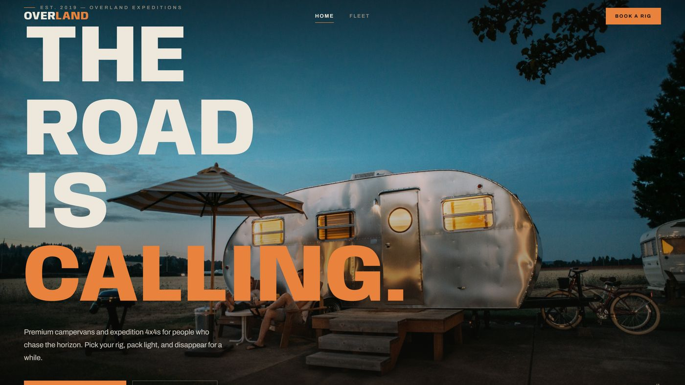
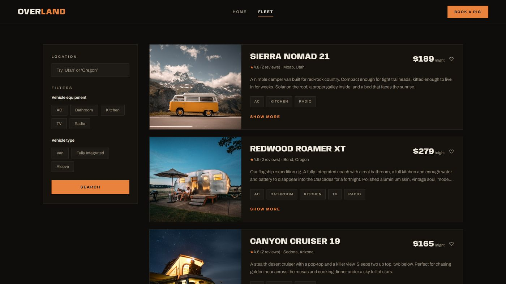
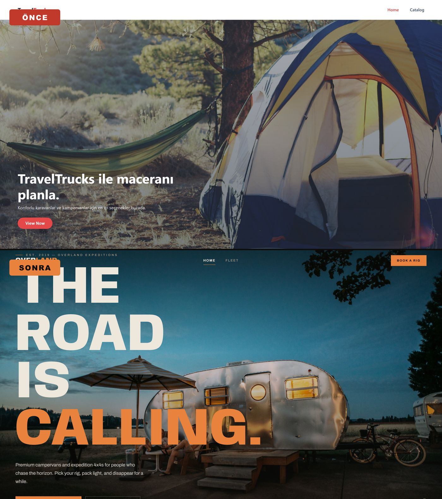

# OVERLAND

> **The road is calling.** — a premium campervan & expedition-4x4 hire platform.

OVERLAND is a dark, cinematic rental experience built with React. Browse a curated fleet of camper vans and motorhomes, filter by location, equipment and vehicle type, save favourites, and book a rig — all wrapped in a custom off-road-themed design system.

**🔗 Live demo → [travel-trucks-eight-theta.vercel.app](https://travel-trucks-eight-theta.vercel.app)**


---

## 📸 Preview



|  |  |
| --- | --- |
|  |  |

---

## ✨ Features

- **Cinematic hero** with a slow-zoom entrance and poster-scale typography
- **Curated fleet** of 8 rigs, each with its own hero image, spec sheet and reviews
- **Live filtering** by location, equipment (AC, kitchen, bathroom…) and vehicle type (van / fully-integrated / alcove)
- **Favourites** persisted in `localStorage`
- **Detail pages** with an image gallery, a features/reviews tab switch, and a booking form
- **Progressive loading** — "Load more" paginates the fleet
- **Fully responsive**, with a full-screen mobile menu and reduced-motion support

## 🧱 Tech Stack

| Layer | Choice |
| --- | --- |
| Framework | **React 19** |
| Routing | **React Router 7** |
| State | **Redux Toolkit** + React Redux |
| Build | **Vite** |
| Styling | Hand-rolled CSS design system (Anybody + Archivo, sunset-amber accent) |
| Hosting | **Vercel** (SPA rewrite for client-side routing) |

The app ships its own local content model — an original, hand-written fleet of US-based rigs — so it runs with **no external API dependency**.

```
src/
├─ pages/        # Home (landing), Catalog (fleet), VehicleDetails
├─ components/   # shared UI
├─ store/        # Redux slices (campers, favorites)
├─ services/     # local fleet "API" (filtering + async shape)
└─ data/         # the hand-written fleet
```

## 🚀 Getting Started

> Requires Node.js 18+

```bash
npm install
npm run dev       # http://localhost:5173
npm run build     # production build
npm run preview   # preview the build
```

## 📐 Design Notes

The identity leans into an expedition / overland aesthetic: a warm near-black canvas, a single sunset-amber accent, and a compressed, technical display face (**Anybody**) paired with a clean grotesque (**Archivo**). Photography is a mix of Unsplash and CC-licensed sources; all fleet names, locations and copy are original.

---

Built by **Canberk Yıldız** — [GitHub](https://github.com/canberkyildiz25)
